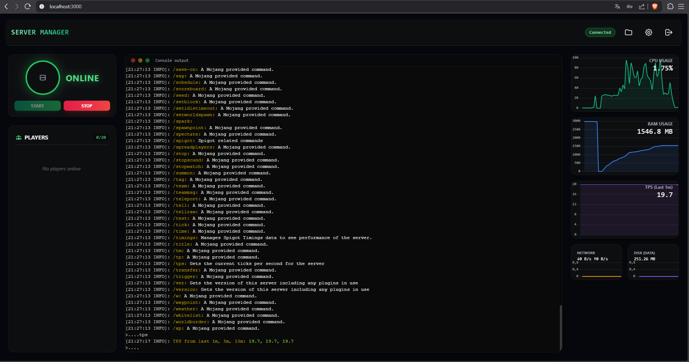

# Minecraft Server Manager


**Minecraft Server Manager** to zaawansowane, kompletne rozwiązanie typu *Self-Hosted* do zarządzania instancjami serwerów Minecraft. Zaprojektowane z naciskiem na bezpieczeństwo, stabilność i intuicyjną obsługę, idealnie sprawdza się zarówno w zastosowaniach domowych, jak i w małych społecznościach gamingowych.

System opiera się na konteneryzacji (Docker), co gwarantuje pełną izolację procesu serwera gry od systemu hosta, zapewniając jednocześnie łatwość wdrożenia i przenoszenia.

---

## 📸 Galeria


### Panel Główny (Dashboard)
 
*Centralne centrum dowodzenia. Umożliwia podgląd statusu serwera, liczby graczy oraz sterowanie zasilaniem (Start/Stop).*

### Monitoring Zasobów i Konsola

*Interaktywna konsola z kolorowaniem składni oraz wykresy użycia CPU, RAM, IO Dysku i Sieci w czasie rzeczywistym.*

### Zintegrowany Menedżer Plików
.
-   **Instalator Wersji**: Wbudowane narzędzie do pobierania i instalacji silników serwerowych.
    -   Obsługa **PaperMC** (zoptymalizowany, zalecany).
    -   Obsługa **Vanilla** (oryginalny silnik Mojang).
-   **Zarządzanie Zasilaniem**: Bezpieczne uruchamianie i zatrzymywanie procesu serwera z obsługą Graceful Shutdown.

### 📊 Monitoring i Diagnostyka
-   **Metryki Real-Time**: WebSocketowe przesyłanie danych o zużyciu zasobów (odświeżanie co sekundy).
-   **Wykresy Historyczne**: Wizualizacja obciążenia z ostatnich 60 sekund.
-   **Analiza TPS**: Monitorowanie *Ticks Per Second* w celu wykrywania lagów serwera.
-   **Lista Graczy**: Podgląd online wraz z awatarami (Head Rendering).

### 📂 System Plików i Transfer
-   **Wbudowany Serwer SFTP (SFTPGo)**: Profesjonalny serwer SFTP działający w tle.
-   **Webowy Menedżer Plików**: Dostęp do plików bezpośrednio z przeglądarki (Upload, Download, Edycja, Uprawnienia).
-   **Kompatybilność**: Pełna obsługa zewnętrznych klientów (FileZilla, WinSCP, Cyberduck).

### 🛡 Bezpieczeństwo
-   **Uwierzytelnianie**: System logowania oparty na sesjach.
-   **Polityka Haseł**: Wymuszenie zmiany domyślnych poświadczeń administratora oraz użytkownika SFTP przy pierwszym uruchomieniu.
-   **Izolacja Sieciowa**: Ograniczenie dostępu do portów, wystawione są tylko niezbędne usługi.

---

## 🛠 Stack Technologiczny

Projekt został zbudowany przy użyciu sprawdzonych, nowoczesnych technologii:

**Backend / Core**
-   **Runtime**: Node.js (v18+)
-   **Framework**: Express.js
-   **Komunikacja Real-Time**: Socket.io
-   **Integracja Docker**: Dockerode

**Frontend**
-   **UI/UX**: HTML5, TailwindCSS (Responsive Design)
-   **Wizualizacja Danych**: Chart.js
-   **Terminal**: Xterm.js (z obsługą FitAddon)

**Infrastruktura**
-   **Orkiestracja**: Docker Compose
-   **File Server**: SFTPGo

---

## ⚙️ Wymagania Systemowe

-   System operacyjny: Linux (zalecany), Windows (z WSL2) lub macOS.
-   **Docker Engine** (wersja 20.10+)
-   **Docker Compose** (wersja 2.0+)
-   Minimum 2GB RAM (zalecane 4GB+ dla nowszych wersji Minecrafta).

---

## 🚀 Instalacja i Wdrożenie

### 1. Pobranie Projektu
Rozpocznij od sklonowania repozytorium na maszynę docelową:

```bash
git clone https://github.com/tomusmac/mcpanel.git
cd mcpanel
```

### 2. Uruchomienie Środowiska
Wykorzystaj Docker Compose do zbudowania i uruchomienia usług w trybie "detached" (w tle):

```bash
docker-compose up -d --build
```

*Proces ten może potrwać kilka minut, w zależności od szybkości łącza (pobieranie obrazów Docker).*

### 3. Konfiguracja Wstępna
1.  **Zabezpiecz Środowisko (WAŻNE)**:
    -   Skopiuj plik `.env.example` na `.env`:
        ```bash
        cp .env.example .env
        ```
    -   Edytuj plik `.env` i zmień domyślne hasła (`SFTPGO_ADMIN_PASSWORD`).
2.  **Uruchomienie**:
    ```bash
    docker-compose up -d --build
    ```
3.  **Logowanie**:
    -   Otwórz `http://localhost:3000`.
    -   Zaloguj się danymi zdefiniowanymi w `.env` (lub domyślnie `admin` / `password`).
    -   System wymusi zmianę hasła przy pierwszym logowaniu.

---

## 📂 Struktura Projektu

```text
├── .env                # Plik konfiguracji środowiska (hasła, porty) - NIE UDOSTĘPNIAJ!
├── docker-compose.yml  # Definicja usług Docker (Panel + SFTPGo)
├── public/             # Pliki statyczne (Frontend: HTML, CSS, JS)
├── src/                # Kod źródłowy Backendu (Node.js)
├── minecraft_data/     # Wolumen z plikami serwera (światy, pluginy) - generowany automatycznie
└── sftpgo_data/        # Wolumen z danymi SFTPGo - generowany automatycznie
```

## ❓ Rozwiązywanie Problemów

-   **Błąd "Port already allocated"**: Upewnij się, że porty 3000, 25565 lub 2022 nie są zajęte przez inne usługi. Możesz je zmienić w pliku `.env`.
-   **Brak połączenia SFTP**: Sprawdź czy kontener `sftpgo` działa (`docker ps`) i czy firewall nie blokuje portu 2022.
-   **Reset Haseł**: Jeśli zapomnisz hasła do panelu, usuń plik `src/config/auth.json` i zrestartuj kontener. Hasło wróci do wartości zdefiniowanych w `.env`.

---

## 📖 Przewodnik Użytkownika

### Instalacja Silnika Gry
Po pierwszym zalogowaniu serwer będzie pusty. Należy zainstalować oprogramowanie serwera:
1.  Kliknij ikonę **Ustawienia (⚙️)** w prawym górnym rogu.
2.  W sekcji "Game Version":
    -   Wybierz typ: **PaperMC** (zalecane) lub Vanilla.
    -   Wybierz wersję gry (np. 1.20.4).
    -   Kliknij **Install**.
3.  Poczekaj na zakończenie procesu. Serwer uruchomi się automatycznie.

### Dostęp przez SFTP
Aby zarządzać plikami (wgrywać mapy `world`, pluginy `.jar` itp.):

**Opcja A: Przez Przeglądarkę**
Kliknij ikonę **Folderu** w górnym pasku nawigacyjnym, aby otworzyć Webowy Menedżer Plików.

**Opcja B: Przez Klienta Zewnętrznego**
Skonfiguruj swojego klienta (np. FileZilla):
-   **Host**: Adres IP serwera
-   **Port**: `2022`
-   **Protokół**: SFTP (SSH File Transfer Protocol)
-   **Użytkownik**: `mcuser`
-   **Hasło**: (Zdefiniowane podczas konfiguracji wstępnej)

---

## 🔧 Architektura Portów

Domyślna konfiguracja `docker-compose.yml` wystawia następujące porty:

| Port | Usługa | Opis |
| :--- | :--- | :--- |
| **3000** | Web Panel | Główny interfejs zarządzania. |
| **25565** | Gra (Minecraft) | Port, na który łączą się gracze w grze. |
| **2022** | SFTP | Port do przesyłania plików. |
| **8080** | SFTPGo Admin/Web | Port webowego klienta plików (używany przez panel). |

---

## 📝 Licencja

Oprogramowanie udostępniane na licencji **MIT**. Oznacza to, że możesz je swobodnie używać, modyfikować i rozpowszechniać, pod warunkiem zachowania informacji o autorach.
